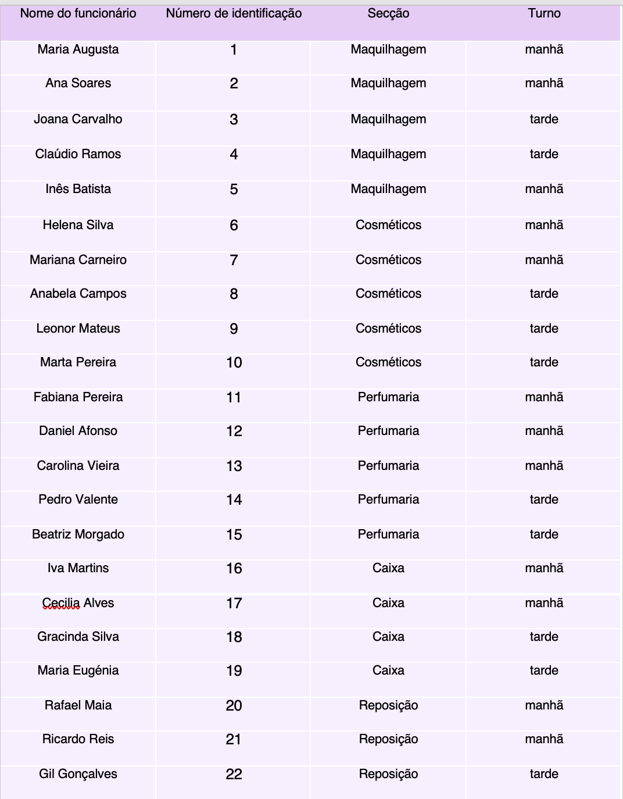

# C3 : SQL

## DDL

CREATE SCHEMA IF NOT EXISTS `mydb` DEFAULT CHARACTER SET utf8 ;
USE `mydb` ;

 Table `mydb`.`Funcionario`
 

CREATE TABLE IF NOT EXISTS `mydb`.`Funcionario` (

  `n.id` INT NOT NULL AUTO_INCREMENT,
  
  `nome` VARCHAR(45) NOT NULL,
  
  `morada` VARCHAR(45) NOT NULL,
  
  `telefone` INT NOT NULL,
  
  PRIMARY KEY (`n.id`))
  
ENGINE = InnoDB;

 Table `mydb`.`Formacao`
 
 
CREATE TABLE IF NOT EXISTS `mydb`.`Formacao` (

  `tipoFormacao` VARCHAR(45) NOT NULL,
  
  `nomeFormacao` VARCHAR(45) NOT NULL,
  
  PRIMARY KEY (`tipoFormacao`))
  
ENGINE = InnoDB;

Table `mydb`.`Turno`

CREATE TABLE IF NOT EXISTS `mydb`.`Turno` (

  `parteDia` VARCHAR(45) NOT NULL,
  
  `hora` INT NOT NULL,
  
  `Funcionario_n.id` INT NOT NULL,
  
  PRIMARY KEY (`parteDia`, `Funcionario_n.id`),
  
  INDEX `fk_Turno_Funcionario_idx` (`Funcionario_n.id` ASC) VISIBLE,
  
  CONSTRAINT `fk_Turno_Funcionario`
  
    FOREIGN KEY (`Funcionario_n.id`)
    
    REFERENCES `mydb`.`Funcionario` (`n.id`)
    
    ON DELETE NO ACTION
    
    ON UPDATE NO ACTION)
    
ENGINE = InnoDB;

 Table `mydb`.`Entrega`

CREATE TABLE IF NOT EXISTS `mydb`.`Entrega` (

  `tipoProduto` INT NOT NULL AUTO_INCREMENT,
  
  `validade` INT NOT NULL,
  
  `reserva` INT NOT NULL,
  
  `quantidade` INT NOT NULL,
  
  PRIMARY KEY (`tipoProduto`))
  
ENGINE = InnoDB;

 Table `mydb`.`Fornecedor`

CREATE TABLE IF NOT EXISTS `mydb`.`Fornecedor` (

  `id` INT NOT NULL AUTO_INCREMENT,
  
  `nome` VARCHAR(45) NOT NULL,
  
  `tipoStock` VARCHAR(45) NOT NULL,
  
  `telefone` INT NOT NULL,
  
  `Entrega_tipoProduto` INT NOT NULL,
  
  PRIMARY KEY (`id`, `Entrega_tipoProduto`),
  
  INDEX `fk_Fornecedor_Entrega1_idx` (`Entrega_tipoProduto` ASC) VISIBLE,
  
  CONSTRAINT `fk_Fornecedor_Entrega1`
  
    FOREIGN KEY (`Entrega_tipoProduto`)
    
    REFERENCES `mydb`.`Entrega` (`tipoProduto`)
    
    ON DELETE NO ACTION
    
    ON UPDATE NO ACTION)
    
ENGINE = InnoDB;

 Table `mydb`.`horario`
 

CREATE TABLE IF NOT EXISTS `mydb`.`horario` (

  `diaSemana` VARCHAR(45) NOT NULL,
  
  `horaFim` INT NOT NULL,
  
  `horaInicio` INT NOT NULL,
  
  `Turno_parteDia` VARCHAR(45) NOT NULL,
  
  `Turno_Funcionario_n.id` INT NOT NULL,
  
  `Fornecedor_id` INT NOT NULL,
  
  PRIMARY KEY (`diaSemana`, `Turno_parteDia`, `Turno_Funcionario_n.id`, `Fornecedor_id`),
  
  INDEX `fk_horario_Turno1_idx` (`Turno_parteDia` ASC, `Turno_Funcionario_n.id` ASC) VISIBLE,
  
  INDEX `fk_horario_Fornecedor1_idx` (`Fornecedor_id` ASC) VISIBLE,
  
  CONSTRAINT `fk_horario_Turno1`
  
    FOREIGN KEY (`Turno_parteDia` , `Turno_Funcionario_n.id`)
    
    REFERENCES `mydb`.`Turno` (`parteDia` , `Funcionario_n.id`)
    
    ON DELETE NO ACTION
    
    ON UPDATE NO ACTION,
    
  CONSTRAINT `fk_horario_Fornecedor1`
  
    FOREIGN KEY (`Fornecedor_id`)
    
    REFERENCES `mydb`.`Fornecedor` (`id`)
    
    ON DELETE NO ACTION
    
    ON UPDATE NO ACTION)
    
ENGINE = InnoDB;

 Table `mydb`.`seccao`
 

CREATE TABLE IF NOT EXISTS `mydb`.`seccao` (

  `gerencia` INT NOT NULL AUTO_INCREMENT,
  
  `cosmetico` VARCHAR(45) NOT NULL,
  
  `fornecedor` VARCHAR(45) NOT NULL,
  
  `reposicao` INT NOT NULL,
  
  `caixa` VARCHAR(45) NOT NULL,
  
  `perfumaria` VARCHAR(45) NOT NULL,
  
  `limpeza` VARCHAR(45) NOT NULL,
  
  `Turno_parteDia` VARCHAR(45) NOT NULL,
  
  `Turno_Funcionario_n.id` INT NOT NULL,
  
  `Fornecedor_id` INT NOT NULL,
  
  PRIMARY KEY (`gerencia`, `Turno_parteDia`, `Turno_Funcionario_n.id`, `Fornecedor_id
  
  INDEX `fk_seccao_Turno1_idx` (`Turno_parteDia` ASC, `Turno_Funcionario_n.id` ASC) VISIBLE,
  
  INDEX `fk_seccao_Fornecedor1_idx` (`Fornecedor_id` ASC) VISIBLE,
  
  CONSTRAINT `fk_seccao_Turno1`
  
    FOREIGN KEY (`Turno_parteDia` , `Turno_Funcionario_n.id`)
    
    REFERENCES `mydb`.`Turno` (`parteDia` , `Funcionario_n.id`)
    
    ON DELETE NO ACTION
    
    ON UPDATE NO ACTION,
    
  CONSTRAINT `fk_seccao_Fornecedor1`
  
    FOREIGN KEY (`Fornecedor_id`)
    
    REFERENCES `mydb`.`Fornecedor` (`id`)
    
    ON DELETE NO ACTION
    
    ON UPDATE NO ACTION)
    
ENGINE = InnoDB;

 Table `mydb`.`Produto`

CREATE TABLE IF NOT EXISTS `mydb`.`Produto` (

  `codigo` INT NOT NULL AUTO_INCREMENT,
  
  `nome` VARCHAR(45) NOT NULL,
  
  `tipoProduto` VARCHAR(45) NOT NULL,
  
  `validade` INT NOT NULL,
  
  PRIMARY KEY (`codigo`))
  
ENGINE = InnoDB;

 Table `mydb`.`Formacao_has_Funcionario`

CREATE TABLE IF NOT EXISTS `mydb`.`Formacao_has_Funcionario` (

  `Formacao_tipoFormacao` VARCHAR(45) NOT NULL,
  
  `Funcionario_n.id` INT NOT NULL,
  
  PRIMARY KEY (`Formacao_tipoFormacao`, `Funcionario_n.id`),
  
  INDEX `fk_Formacao_has_Funcionario_Funcionario1_idx` (`Funcionario_n.id` ASC) VISIBLE,
  
  INDEX `fk_Formacao_has_Funcionario_Formacao1_idx` (`Formacao_tipoFormacao` ASC) VISIBLE,
  
  CONSTRAINT `fk_Formacao_has_Funcionario_Formacao1`
  
    FOREIGN KEY (`Formacao_tipoFormacao`)
    
    REFERENCES `mydb`.`Formacao` (`tipoFormacao`)
    
    ON DELETE NO ACTION
    
    ON UPDATE NO ACTION,
    
  CONSTRAINT `fk_Formacao_has_Funcionario_Funcionario1`
  
    FOREIGN KEY (`Funcionario_n.id`)
    
    REFERENCES `mydb`.`Funcionario` (`n.id`)
    
    ON DELETE NO ACTION
    
    ON UPDATE NO ACTION)
    
ENGINE = InnoDB;

 Table `mydb`.`Entrega_has_Produto`

CREATE TABLE IF NOT EXISTS `mydb`.`Entrega_has_Produto` (

  `Entrega_tipoProduto` INT NOT NULL,
  
  `Produto_codigo` INT NOT NULL,
  
  PRIMARY KEY (`Entrega_tipoProduto`, `Produto_codigo`),
  
  INDEX `fk_Entrega_has_Produto_Produto1_idx` (`Produto_codigo` ASC) VISIBLE,
  
  INDEX `fk_Entrega_has_Produto_Entrega1_idx` (`Entrega_tipoProduto` ASC) VISIBLE,
  
  CONSTRAINT `fk_Entrega_has_Produto_Entrega1`
  
    FOREIGN KEY (`Entrega_tipoProduto`)
    
    REFERENCES `mydb`.`Entrega` (`tipoProduto`)
    
    ON DELETE NO ACTION
    
    ON UPDATE NO ACTION,
    
  CONSTRAINT `fk_Entrega_has_Produto_Produto1`
  
    FOREIGN KEY (`Produto_codigo`)
    
    REFERENCES `mydb`.`Produto` (`codigo`)
    
    ON DELETE NO ACTION
    
    ON UPDATE NO ACTION)
    
ENGINE = InnoDB;

SET SQL_MODE=@OLD_SQL_MODE;

SET FOREIGN_KEY_CHECKS=@OLD_FOREIGN_KEY_CHECKS;

SET UNIQUE_CHECKS=@OLD_UNIQUE_CHECKS;

## DML

### Tabela Funcionário

#### Mencione o nome do funcionário com o número Id 17:

SELECT nome
FROM Funcionarios
WHERE Id= “17”

#### Mencione todos os funcionários da secção reposição:

SELECT nome
FROM funcionarios
Where Seccao= “reposiçao”

#### Mencione os funcionários do turno da tarde:

SELECT nome
FROM funcionarios
WHERE turno= "tarde"

---
[< Previous](rebd04.md) | [^ Main](https://github.com/exemploTrabalho/reportSIBD/) | Next >
:--- | :---: | ---: 
